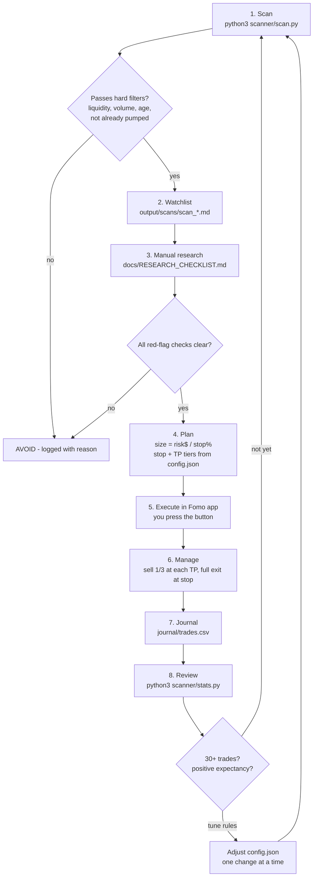

# Claude-Fomo-1: Meme Coin Research & Trading Workflow

This is a rules-based workflow for finding, checking, sizing, and reviewing meme coin trades you place in the Fomo app.
It gives you three things:

1. **Scanner** (`scanner/scan.py`). It pulls live market data from DexScreener's public API, drops tokens that fail basic safety filters, and writes a watchlist with position size, stop, and take-profit levels.
2. **Research checklist** (`docs/RESEARCH_CHECKLIST.md`). You go through it by hand before any buy.
3. **Journal + stats** (`journal/trades.csv` → `scanner/stats.py`). You log every trade, and it reports your real win rate, expectancy, profit factor, and drawdown, by setup.

> **Read this first.** Most meme coins go to zero, and many are built to rug their buyers. No scanner or AI can reliably tell you "buy now, sell at the top". This system does not promise profit. It helps you **avoid obvious traps, size small, exit by rule, and measure honestly**. That way, after enough trades, your own numbers show whether you have an edge. Only trade money you can afford to lose.

## Workflow



## Quick start

```bash
python3 scanner/scan.py          # live scan -> output/scans/scan_<time>.md + .csv
python3 scanner/stats.py         # journal -> output/reports/performance.md
python3 -m unittest discover -s tests
```

It needs only the Python 3 standard library. The live scan needs internet access to `api.dexscreener.com`.
To test offline, run `python3 scanner/scan.py --fixture tests/fixtures/sample_pairs.json`. That file holds synthetic test data.

## Folder layout

| Path | Purpose |
|---|---|
| `config.json` | Filters, scoring, and risk rules (account size, risk per trade, stop, TP tiers, daily loss limit) |
| `scanner/scan.py` | Live screener → `output/scans/` |
| `scanner/stats.py` | Performance report from your journal → `output/reports/` |
| `journal/trades.csv` | One row per closed trade (you fill it in) |
| `docs/RESEARCH_CHECKLIST.md` | Checks to run before every entry |
| `docs/QUESTIONS.md` | Setup questions I need answered before tuning the system |
| `output/` | All generated reports |

## Where the numbers come from

- Scanner figures are the raw DexScreener API values at scan time: price, liquidity, volume, transaction counts, price change, FDV, and pair age. Nothing is estimated.
- Performance figures come only from trades you log. Treat anything under about 30 trades as noise.
- The thresholds in `config.json` are **starting assumptions, not proven edges**. Change them only when your journal stats justify it.

## About giving Claude account access

Don't share your Fomo password, seed phrase, or private keys with me or anyone else. Fomo has no public trading API I can safely connect to. The safe setup is: I scan and research and produce the plan, you place the trade in the app, and you log it in the journal.
