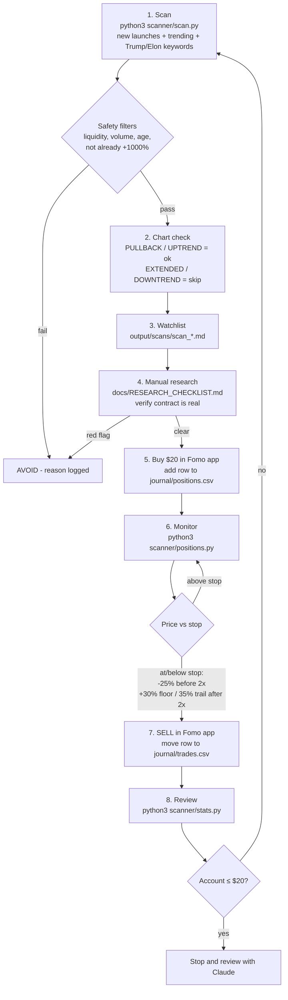

# Claude-Fomo-1: Meme Coin Research & Trading Workflow

This is a rules-based workflow for finding, checking, sizing, and reviewing meme coin trades you place in the Fomo app.
It gives you three things:

1. **Scanner** (`scanner/scan.py`). It pulls live market data from DexScreener's public API, drops tokens that fail basic safety filters, and writes a watchlist with position size, stop, and take-profit levels.
2. **Research checklist** (`docs/RESEARCH_CHECKLIST.md`). You go through it by hand before any buy.
3. **Journal + stats** (`journal/trades.csv` → `scanner/stats.py`). You log every trade, and it reports your real win rate, expectancy, profit factor, and drawdown, by setup.

> **Read this first.** Most meme coins go to zero, and many are built to rug their buyers. No scanner or AI can reliably tell you "buy now, sell at the top". This system does not promise profit. It helps you **avoid obvious traps, size small, exit by rule, and measure honestly**. That way, after enough trades, your own numbers show whether you have an edge. Only trade money you can afford to lose.

## Workflow

Your plan: **$50 → $100, max loss $30.** Full rules are in [`docs/STRATEGY.md`](docs/STRATEGY.md).



## Daily routine

| When | Command | Output |
|---|---|---|
| Each time you check the app | `python3 scanner/positions.py` | `output/reports/positions.md`: HOLD or SELL per coin |
| Looking for a new trade (max 2 open) | `python3 scanner/scan.py` | `output/scans/scan_<time>.md` watchlist with size, stop, 2x and +30% floor prices |
| After you sell | add a row to `journal/trades.csv`, then `python3 scanner/stats.py` | `output/reports/performance.md` |

Each scan also appends to `output/history.csv`. The next scans use it to show how each coin's market cap has grown since it was first seen. That growth record is how "has it kept growing?" gets answered with real numbers.

## Quick start

```bash
python3 scanner/scan.py                      # live scan (add --no-charts to skip chart checks)
python3 scanner/chart.py solana <pair_addr>  # chart read for one coin
python3 scanner/positions.py                 # HOLD/SELL on what you own
python3 scanner/stats.py                     # your real performance
python3 -m unittest discover -s tests
```

It needs only the Python 3 standard library. The live commands need internet access to `api.dexscreener.com` and `api.geckoterminal.com`.
For an offline demo, run `python3 scanner/scan.py --fixture tests/fixtures/sample_pairs.json`. That file holds synthetic test data.

## Folder layout

| Path | Purpose |
|---|---|
| `config.json` | Filters, hype keywords, and risk and exit rules |
| `scanner/scan.py` | Live screener → `output/scans/`, `output/history.csv` |
| `scanner/chart.py` | Hourly chart trend: UPTREND / PULLBACK / EXTENDED / DOWNTREND / CHOP |
| `scanner/positions.py` | HOLD/SELL for coins you own → `output/reports/positions.md` |
| `scanner/stats.py` | Performance from your journal → `output/reports/performance.md` |
| `journal/positions.csv` | Coins you hold now. `holders` column: append counts from the app like `1200/1350/1500` to track holder growth |
| `journal/trades.csv` | One row per closed trade |
| `docs/STRATEGY.md` | Your $50 → $100 plan, exit rules, the realistic picture on Trump/Elon coins |
| `docs/RESEARCH_CHECKLIST.md` | Checks before every buy |
| `docs/QUESTIONS.md` | Your answers + open questions |

## Where the numbers come from

- Scanner and position figures are the raw DexScreener and GeckoTerminal API values at scan time: price, liquidity, volume, transaction counts, price change, FDV, and pair age. Nothing is estimated.
- Performance figures come only from trades you log. Treat anything under about 30 trades as noise.
- The thresholds in `config.json` are **starting assumptions, not proven edges**. Change them only when your journal stats justify it.

## About giving Claude account access

Don't share your Fomo password, seed phrase, or private keys with me or anyone else. Fomo has no public trading API I can safely connect to. The safe setup is: I scan and research and produce the plan, you place the trade in the app, and you log it in the journal.
